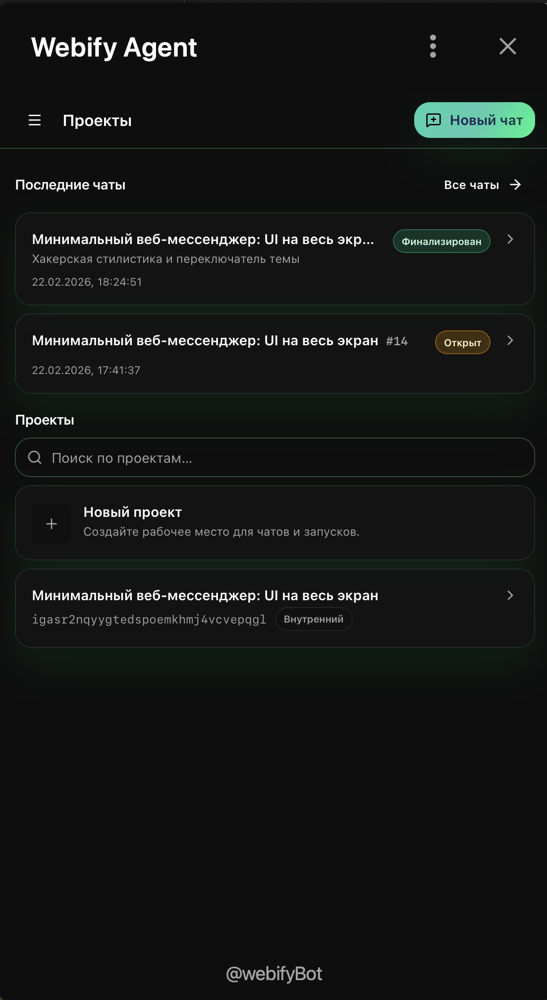
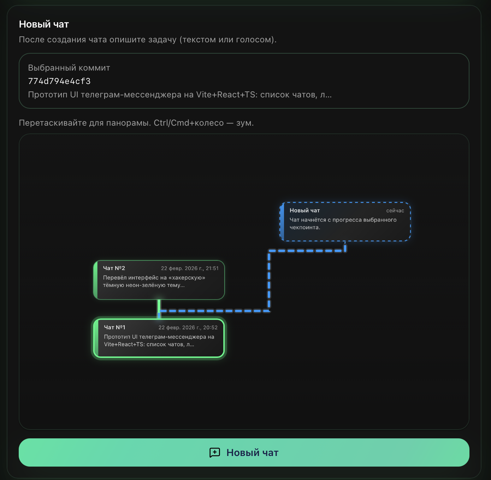
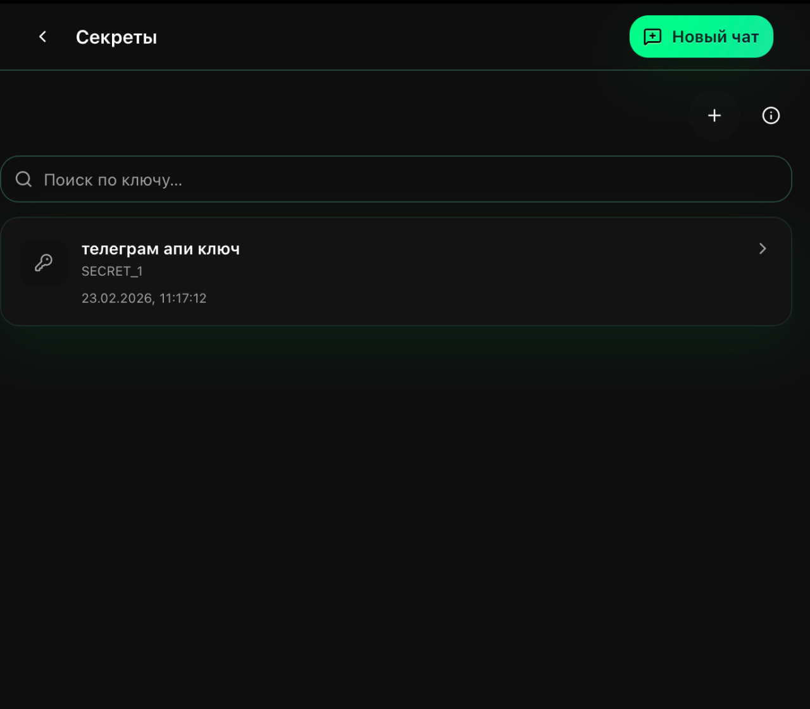
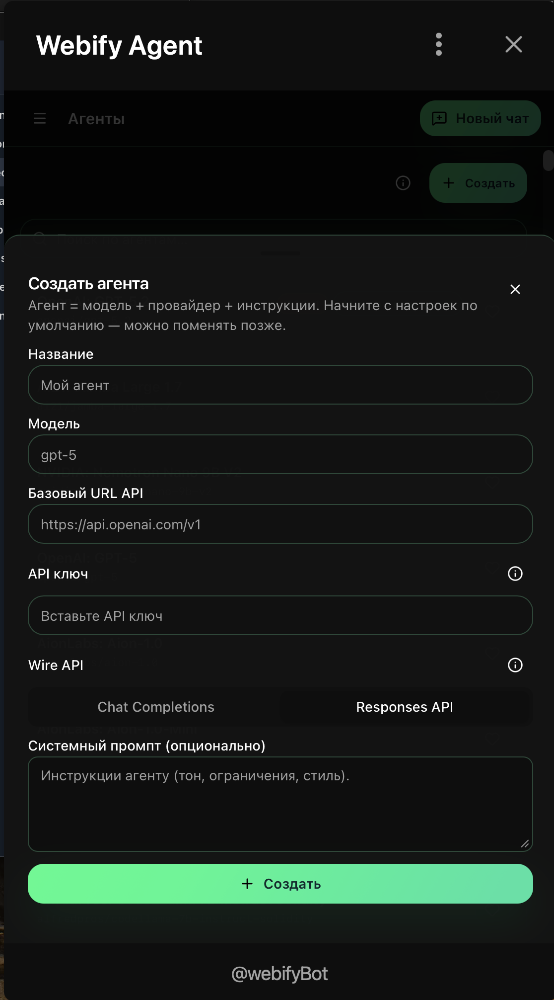
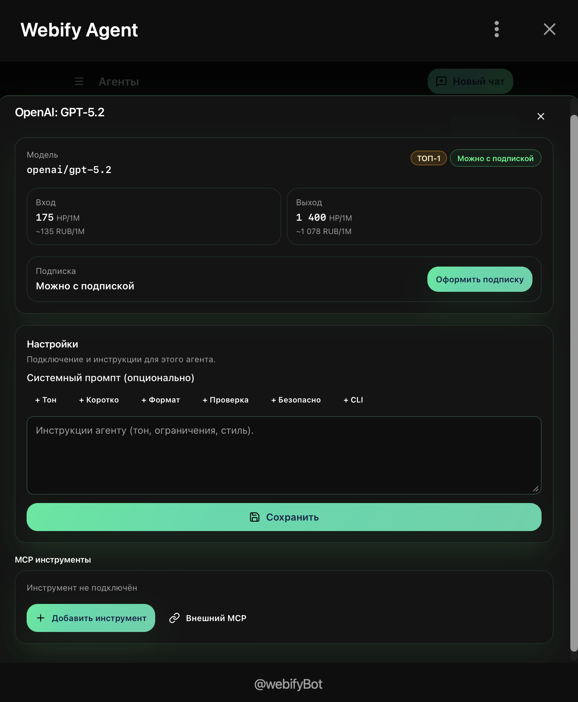
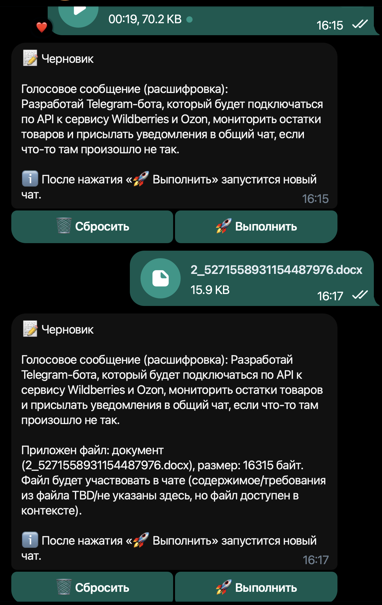
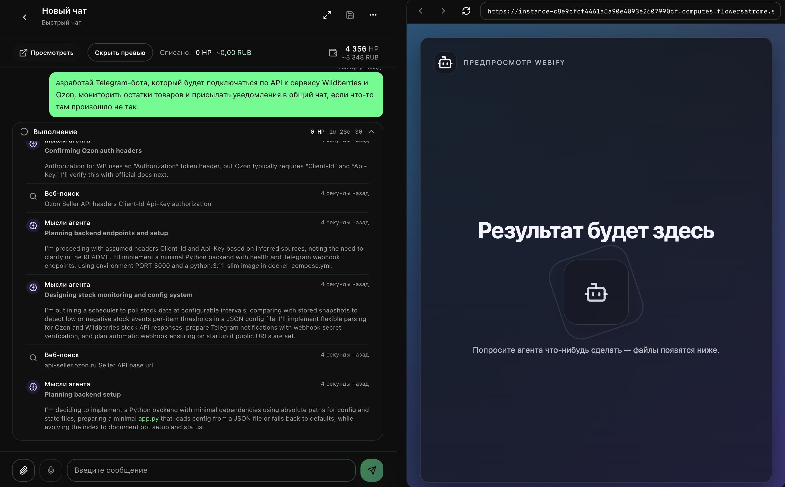

# Webify: a platform for **real** native-development (no servers)

## Notice

We have a clear plan for scaling our business, specific requests for investors, and proposals, and we are open to communication. We are currently seeking investment to open up to the general public, but until then, distribution is proceeding smoothly so as not to encounter mass rejections from LLM providers. Support in this competition would help us grow a little faster. For a demo, please contact us on Telegram at https://t.me/tvmdoc

The system is already up and running and we already have users, but at the moment we are undergoing controlled growth so that the experience of each new user is even better and does not encounter any problems.

You create a bot in Telegram, then assemble its “brain” (model) and “skills” (tools/integrations) so it can solve real user tasks — **without you running your own server**.

In short:
- Telegram is the **interface + distribution channel**.
- Webify is the **managed runtime, tools, security, billing, and control layer**.
- Users get a bot that **actually gets work done**, not just a “chatty AI”.

## What everyday users get

Users don’t want “AI”. They want **outcomes**:

- “Build me a product launch plan” → get a plan + checklist + files.
- “Analyze this spreadsheet/document” → get conclusions + recommendations + a final deliverable.
- “Draft a landing page” → get structure, copy variants, links/assets.
- “Track my tasks and send status” → get clear statuses and next-step buttons.

The key: it’s still **one Telegram bot** — it’s just capable because it has:
- a “brain” (chosen model),
- “skills” (tools and integrations),
- “memory/context” (projects and task history),
- “discipline” (execution statuses and cost controls).

## “Brains” and “skills”: models and tools

In Webify, the “model” is part of an agent configuration. In practice this means:
- you can use **different providers/models** depending on the task and budget;
- you can connect **OpenAI-compatible APIs** (a unified request format);

How it looks in the product:
- in **Agents**, you pick the model/provider and key parameters;
- you can keep multiple agents for different scenarios: “fast/cheap”, “accurate/premium”, “safe/locked-down”.

### Skills (tools and integrations)

To be “real”, a bot needs actions — not just text.

In Webify, skills are delivered via a **tools catalog** (under the hood: MCP):
- tools can be attached to an agent as modules;
- there’s a managed mode (the platform runs and operates the tool);
- there’s an external mode (connect a tool by URL if you already host it elsewhere).

Examples of skills that map well to Telegram use cases:
- browser automation (including web forms),
- file workflows (spreadsheets/docs/archives),
- integrations with external APIs,
- support/moderation/analytics, Ops notifications.

## How it works (simple model, no “AI hype”)

### Mental model: “project → chat → execution → result”

1) **Project** = a context workspace.  
   It stores what the bot works on: settings, secrets, connected skills, and (optionally) linked repos/integrations.

2) **Chat** = a task thread/history.  
   You send a request, attach a file, iterate.

3) **Execution (run)** = one concrete run with:
   - a status (queued/running/done/error),
   - the ability to use skills (tools),
   - outputs and artifacts (files/links).

4) **Results** show up in the WebApp (inside Telegram), while Telegram chat is used for quick entry and notifications.

### Telegram UX without spam: Telegram = entry + “done”, WebApp = workplace

To feel native in Telegram, the bot must not become a notification machine.

Expected UX:
- In Telegram, the user sends a task → gets a short acknowledgement (“Got it, running…”) + a button **“Open Webify”**.
- While the user is in the WebApp, Telegram stays quiet.
- When execution finishes and the user is not in the WebApp, Telegram sends a concise “done/error” + a button **“Open chat”**.

This keeps Telegram a messenger, and the WebApp a tool.

### Why this is not “AI madness”

Webify is not “a chatbot for the sake of a chatbot”.

Webify is about **managed work**:
- tasks have state and history,
- bots have explicit skills with access control,
- the product has economics (limits and costs),
- users get predictable UX.

---

## Screenshots: the Webify WebApp experience

### Screen 1 — Projects / Applications

What it is: the projects list (workspaces/contexts).

What to show:
- empty state (“create your first project”),
- 2–3 real projects,
- “Start chat” action.

Why Telegram cares: projects make bots feel like products, not disposable chats.

---

### Screen 2 — Project detail

What it is: the control center for one bot/project.

What to show:
- project header (name/description),
- links to secrets/deployments/integrations.

Why Telegram cares: bots become configurable products, not “code somewhere”.

---

### Screen 3 — Secrets

What it is: secure key/config storage (API keys, tokens, credentials).

What to show:
- list of secrets without revealing values,
- add secret flow,
- examples: model provider key / external API key.
- just human names, no values or technical details.

Why Telegram cares: trust. Product bots require real security.

---

### Screen 4 — Agents (`/agents`)

What it is: “brain configuration”: which models to use and which skills are connected.

What to show:
- agents list (e.g. Default / Pro / Safe),
- model/provider selection,
- Tools/Skills section (attached tools).

Why Telegram cares: multiple models + multiple skills = an ecosystem, not a single feature.

---

### Screen 5 — Chat / Execution (`/chats/:id`)

What it is: the core “get work done” screen: request → progress → result → files.

What to show (the single most important screenshot):
- message composer,
- execution progress/status,
- final result,
- artifacts (file/link/table),
- a moment where a skill/tool is clearly used (real action, not just text).

Why Telegram cares: this is what turns “a bot” into “a service inside Telegram”.

---

